Операційні системи

Лабораторна робота 5

 

Виконав 

студент 3-го курсу

факультету інформаційних технологій

спеціальності «Інженерія програмного забезпечення»

Ужгородського Національного Університету

Андрух Микита Євгенович
 
 
 

<h1 align="center">Деплой проекту на AWS EC2</h1>

### Завдання
Create terraform scenario for provisioning infrastructure on GCP (or AWS) cloud Requirement

>1. Зареєструватись на AWS. 

>2. Створити інстанс EC2

>3. Задеплоїти проект (може бути  html сторінка) і скинути посилання в звіт для можливості перегляду

 
<h1 align="center">Хід роботи</h1>
 
Система – Ubuntu

 

Тип – дефолтний
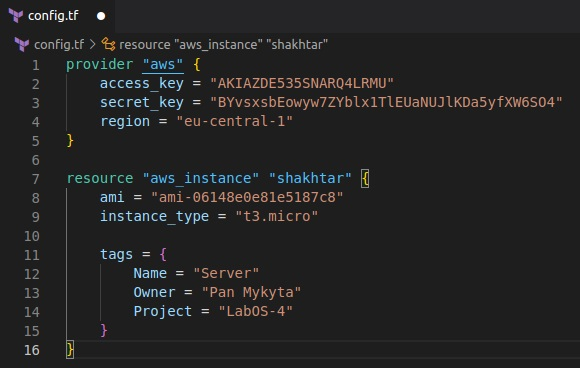

 

Створюю новий SSH-ключ ***shakhtar_key***
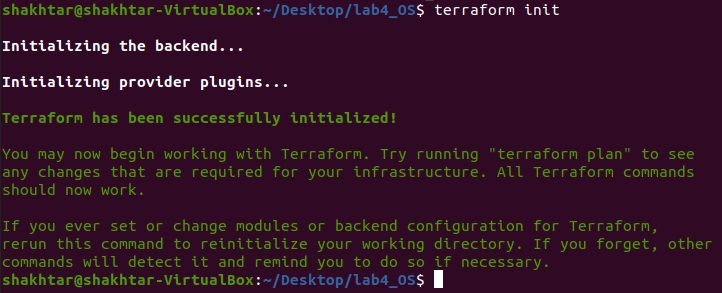

 

Встановив вхідний трафік на 80-ий порт.
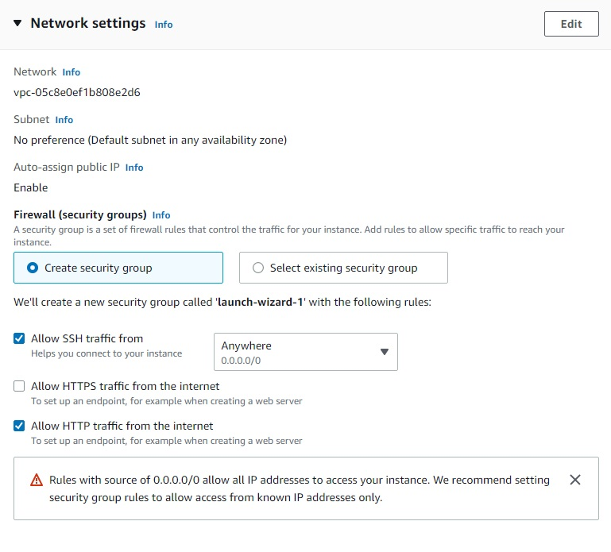

 

Створив та запустив інстенс
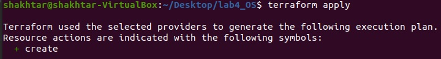

Так виглядає SSH-клієнт та інструкція, за допомогою якої можна підключитися до віддаленої VM
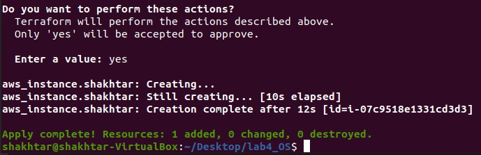

Змінив дозвіл файлу з ключем на 400-й
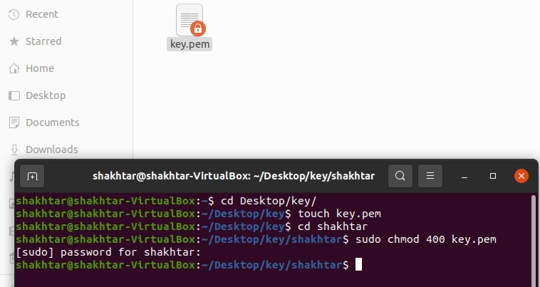

 

Успішно підключився до віддаленої віртуальної машини за допомогою команди, що є в SSH-клієнті
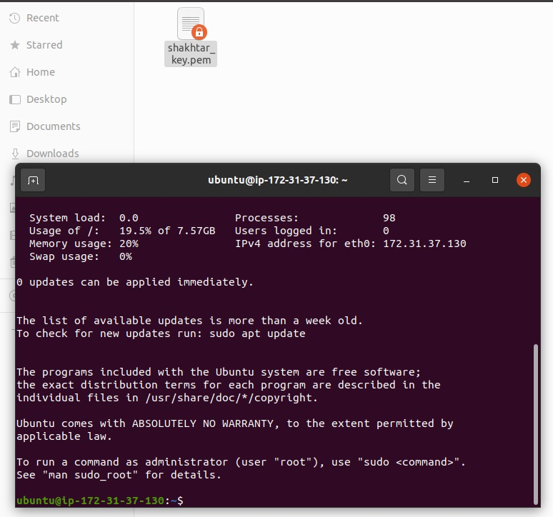

 

Прописуємо наступні команди для оновлення системи і установки Apache-серверу:

 

sudo apt update

 

sudo apt upgrade

 

sudo apt install apache2

 

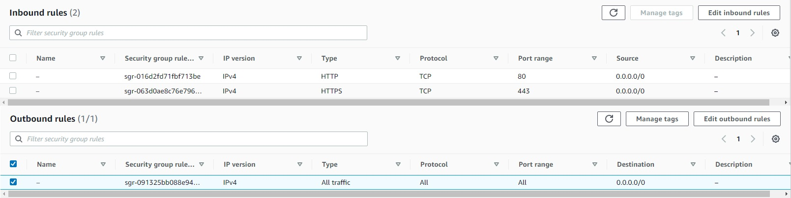

 

Скинув файл ***index.html*** на віддалену VM
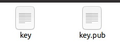

 
 

Замінив файл за розташуванням нижче
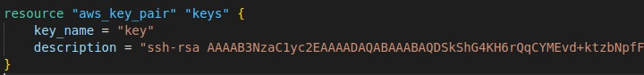

Як бачимо, результат – на лице
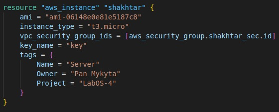