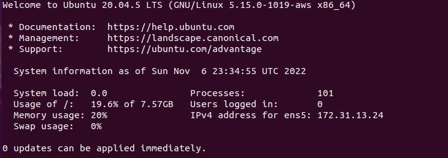
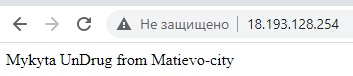

Операційні системи

Лабораторна робота 4

 

Виконав 

студент 3-го курсу

факультету інформаційних технологій

спеціальності «Інженерія програмного забезпечення»

Ужгородського Національного Університету

Андрух Микита Євгенович
 
 
 

<h1 align="center">Terraform</h1>

### Завдання
Create terraform scenario for provisioning infrastructure on GCP (or AWS) cloud Requirement

>1. Create one instance (image: ubuntu 20.04

>2. Allow HTTP/HTTPS traffic on a NIC

>3. Provision one SSH public key for created instance

>4. Install Web Server (Apache HTTP Server / NGINX HTTP Server) via bash scenario

 
<h1 align="center">Хід роботи</h1>
 
1. Поклав Terraform, зарегався на AWS і створив юзера

 

>Створив файл `config.tf`, прописав провайдера і створив ресурс, який за допомогою Terraform буде розміщено та запущено на AWS.

 

>Команда ***terraform init***

 

> Через ***terraform plan*** дізнаємося, що буде зроблено командою ***terraform apply***.

 

> Команда ***terraform apply*** (розміщення і запустити на AWS)

 

2. Налаштував мережевий інтерфейс за допомогою ***aws_security_group***

 

Результат

 

***ssh-keygen -t rsa -b 2048*** генерує приватний і публічний SSH-ключ для ресурсу

 
 

Ключ для головного instance кидаємо в новостворений ресурс

 

У головному instance вказуємо щойно створений ключ.
 

 

***chmod 400 key*** задає дозвіл файлу з приватним SSH-ключем.
***ssh -i "key" ubuntu@ec2-18-157-84-18.eu-central-1.compute.amazonaws.com*** входить до віддаленої системи

 

***sudo apt update***

 

***sudo apt upgrade***

 

***sudo apt install apache2***

 

***sudo ufw allow in "Apache Full"***

 

***sudo systemctl restart apache2***

 

Cтворюємо новий index.html і замінюємо шляхом /var/www/html/index.html
***mv -i index.html /var/www/html/index.html***

 

Результат:

 

