Операційні системи

Лабораторна робота 2

 

Виконав 

студент 3-го курсу

факультету інформаційних технологій

спеціальності «Інженерія програмного забезпечення»

Ужгородського Національного Університету

Андрух Микита Євгенович
 
 
 

<h1 align="center">Використання GitHub Actions</h1>

### Завдання

>1. Ознайомитись із поняттями CI/CD та GitHub Actions. 

>2. Задеплоїти проект на EC2 або VPS за допомогою GitHub Actions.

>3. Ознайомитись із github pipelines та використати їх для реалізації CI/CD.

 
<h1 align="center">Хід роботи</h1>
 
1. Генеруємо проєкт на https://start.spring.io/, вибравши Maven та  Java 11. Після генерації починається автоматичне завантажування
Система – Ubuntu
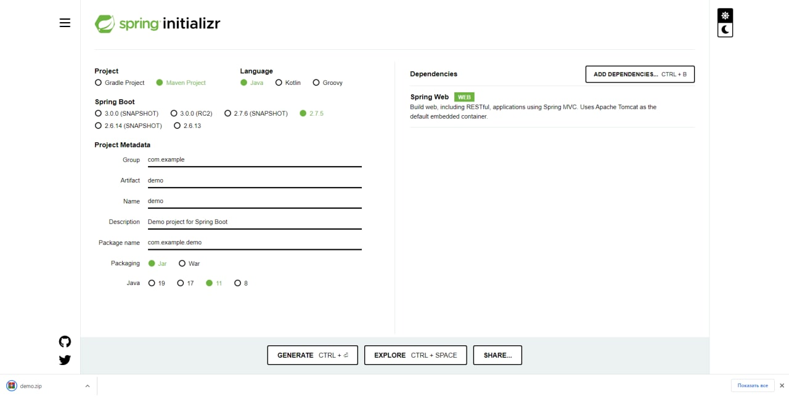
 
2. Відкриваємо в VS code
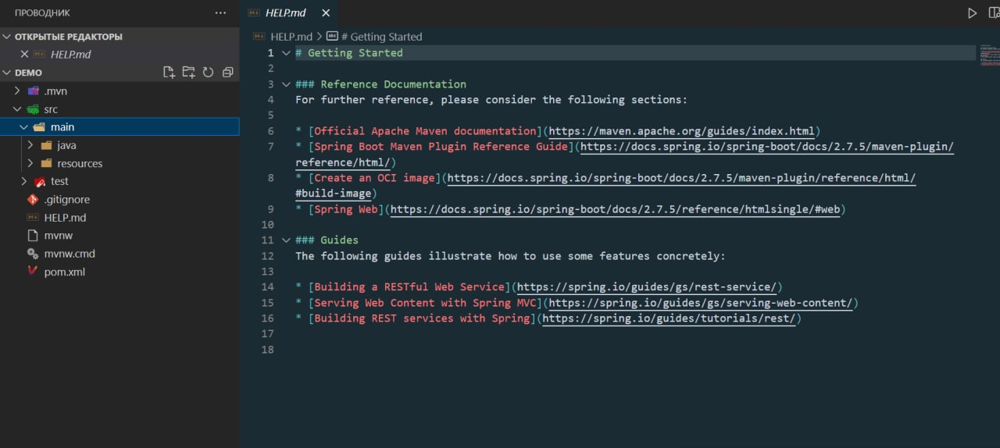

3. Запушив проєкт
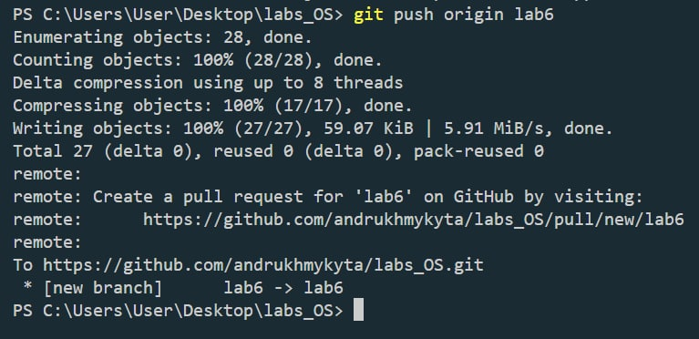

4. Створюємо EC2-instance

5. Вибираємо тип та генеруємо пару ключів
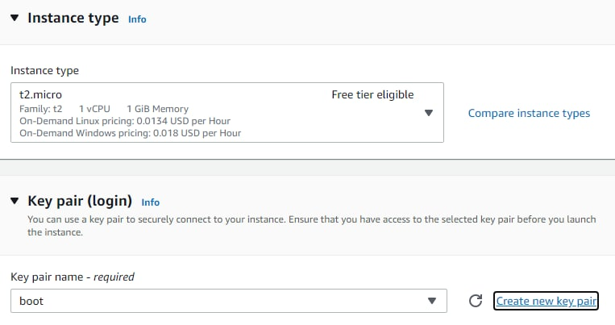

6. Налаштування мережевих інтерфейсів
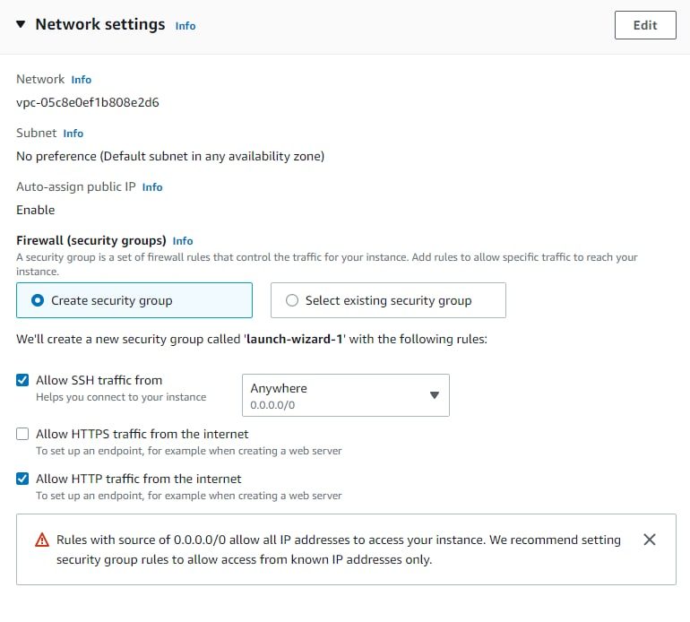

7. Успішно створено
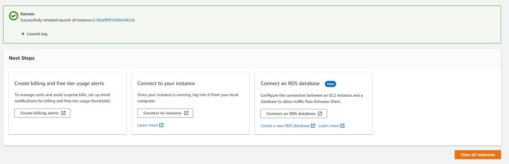

8. Підключився до віддаленої машини
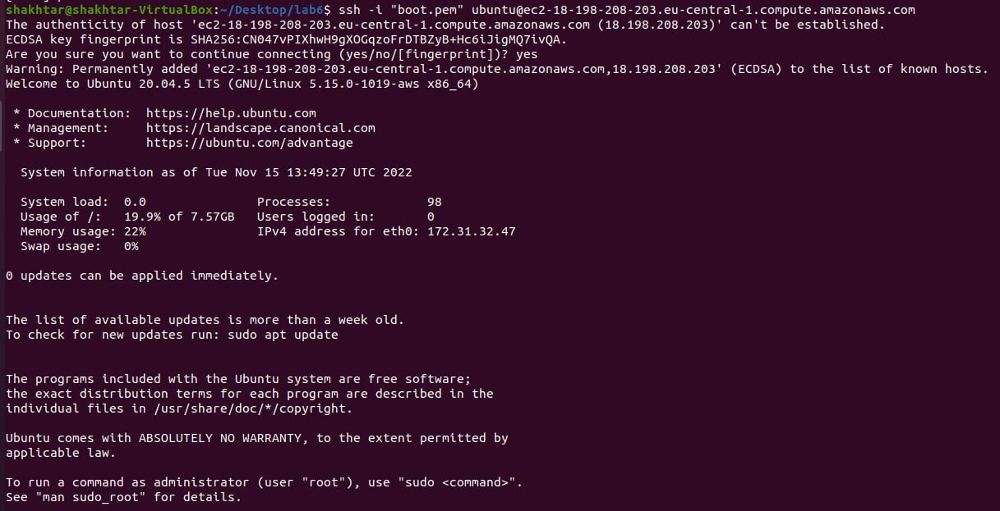

9. Переходимо в setting - actions - runners, і клікаємо на зелену кнопочку
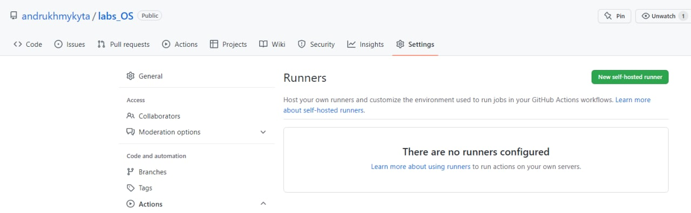

10. Прописуємо виділені команди на віддаленій VM
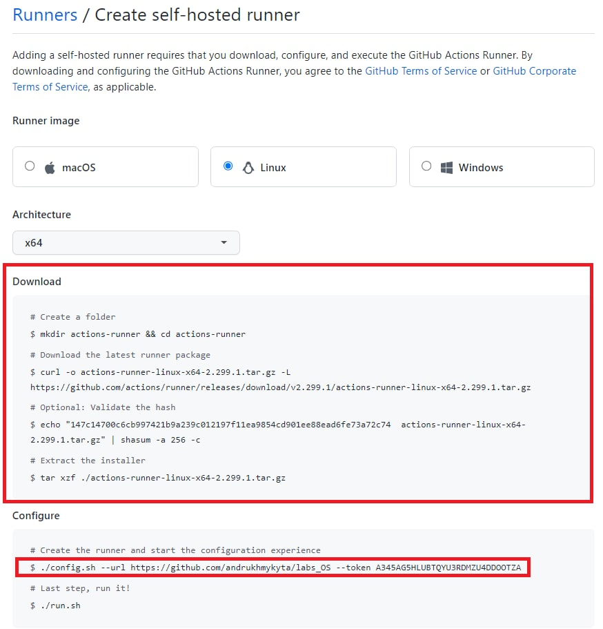

11. 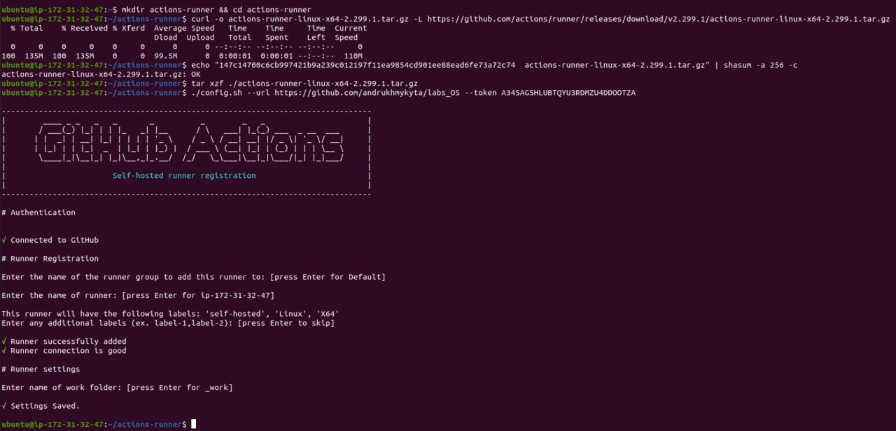

12. 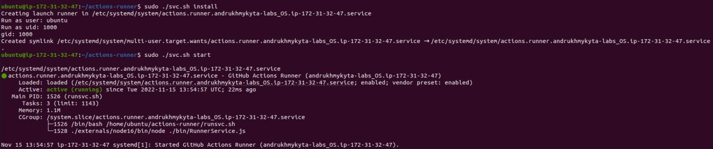

13. Вибираємо Java with Maven
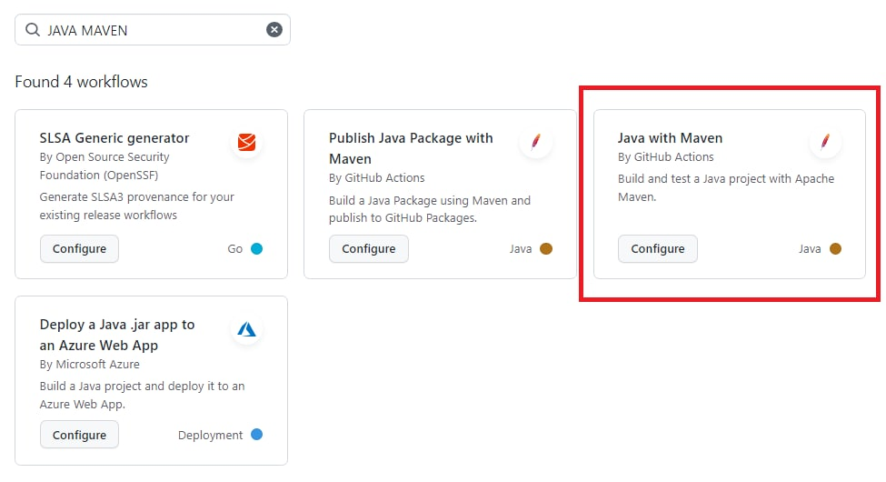

14. Підредачили трошки файл maven.yml
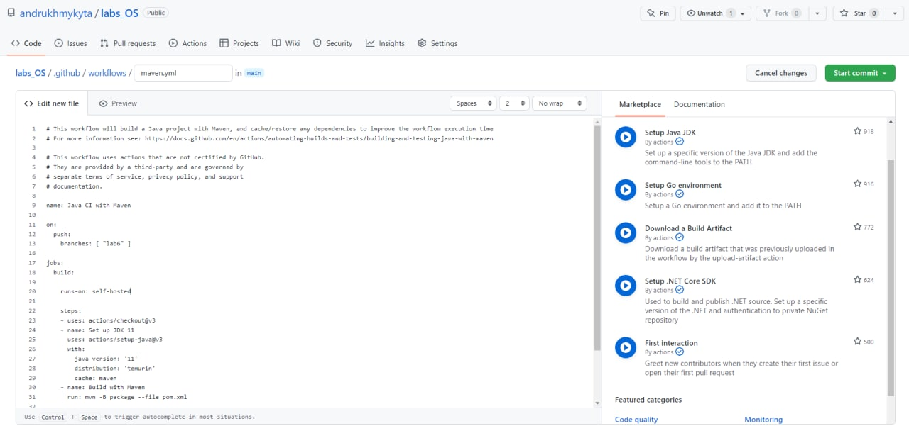

15. ВНОСИМО ЗМІНИ!!!
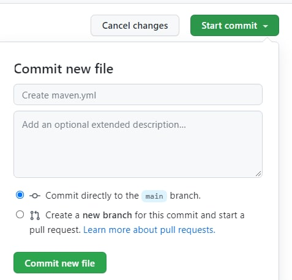

16. У нас появився файлик. NICE!
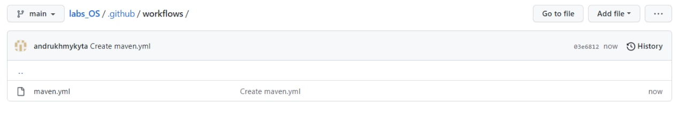

17. Оновлюємо пакети
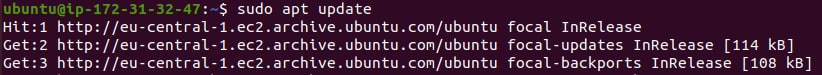

18. Установлюємо Maven та жабу
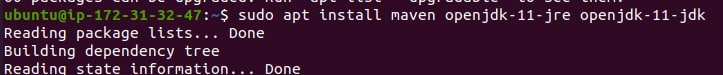

19. Maven Є!!!
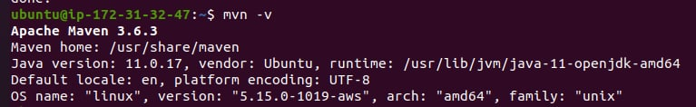

20. Жаба також Є!!!
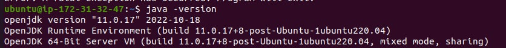

21. Перезапускаємо ci/cd pipeline
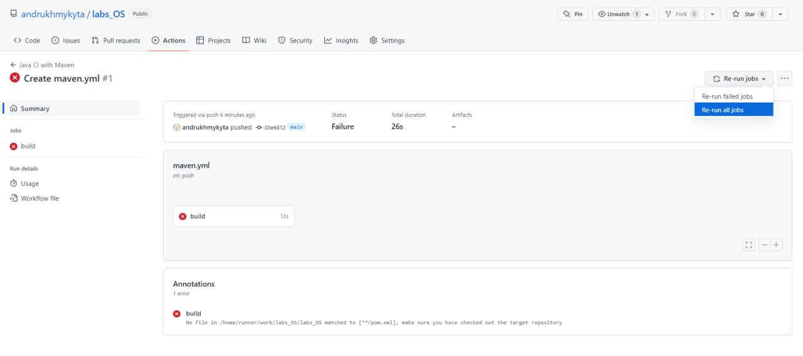

22. Висновок один – деплой пройшов успішно, а я молодець!
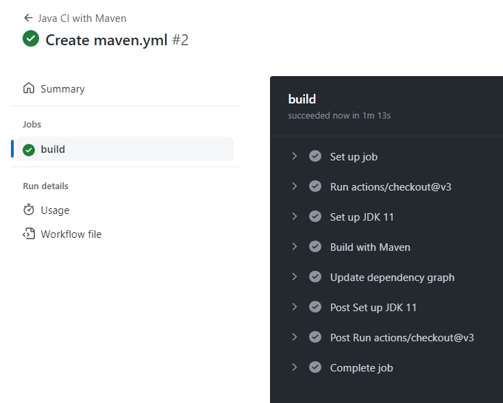

23. Знайшли JAR-файл, який відповідає за запуск проєкту на Spring Boot
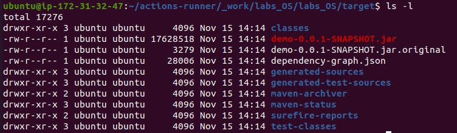

24. Додаємо команду, яка відповідає за запуск проєкту
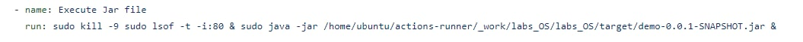

25. Все ж таки я живий – успішно підключилися до серверу – `http://18.198.208.203/`
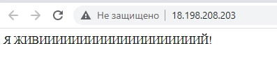